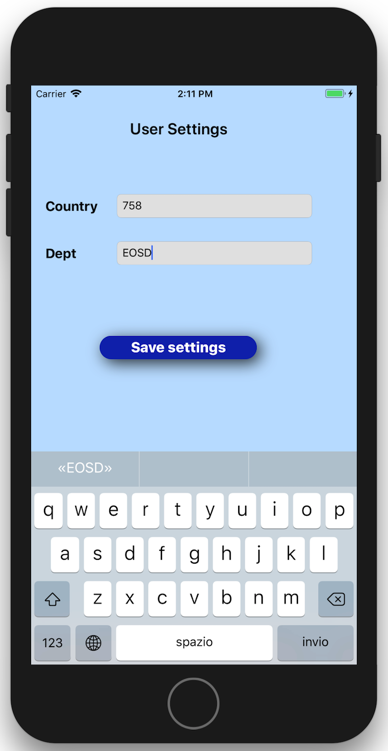
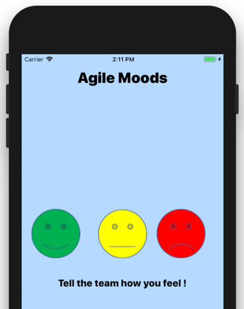
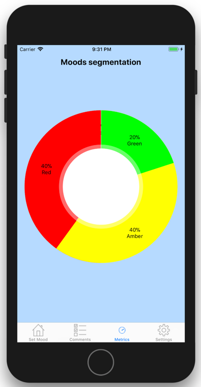
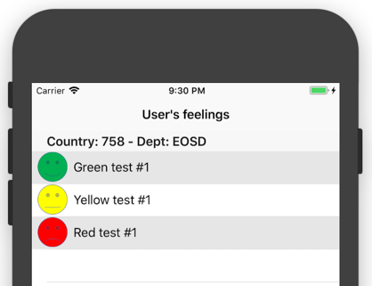
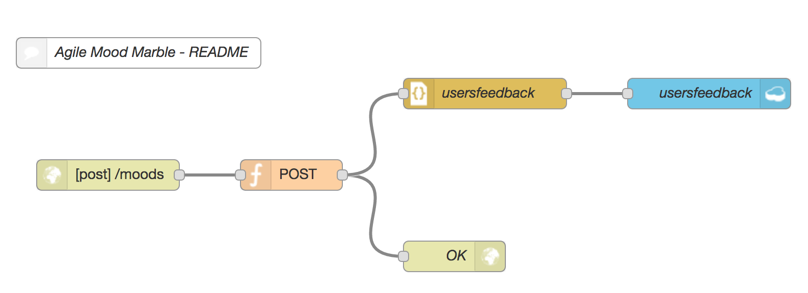

Mood Marble Agile tool - iOS Client
====================================

### Italy THINKDESK Mood Marble tool
This application is intended to support the the Mood Marble Agile practice. This is the instance
that supports the mobile side of the application. The code of web version could be reached at the following address: `https://github.com/marcodago/AgileMoodMarbles-BlueMix`.
Web version of this solution can be reached at: http://ibm.biz/moodmarbles

This app has been developed using `Apple XCode` and `Node-Red starter` boilerplate.  

### How does this work?
At first launch of iOS app, you'll be requested to identify yourself filling the information related to the country & department (`Settings` tab). These info are necessary to categorize evaluations under the right organization, given that CloudantDB where data are stored is unique. No other info are stored onto device, to guarantee user's privacy. After that, moving on the `Set Mood` tab, simply press the smiley that better fit with your feeling.

  

A possibility to leave a comment is also included. When done, you could move on the `Commets`tab to visualize the list of marbles for the profiled country & department or you can visualize the overall score selecting `Metrics`tab.

   

### Customising Node-RED
This repository is here to be cloned, modified and re-used to allow anyone create
their own Node-RED based application that can be quickly deployed to Bluemix.

The Node-Red flow is stored in the `root` directory in the file called `flow.json`.
When the application is first started, this flow is copied to the attached Cloudant
instance. Otherwise, you could copy the entire flow and paste it into Node-Red, using the import capability.

If you do clone this repository, make sure you update this `README.md` file to point
the `Deploy to Bluemix` button at your repository.

Marco D.

